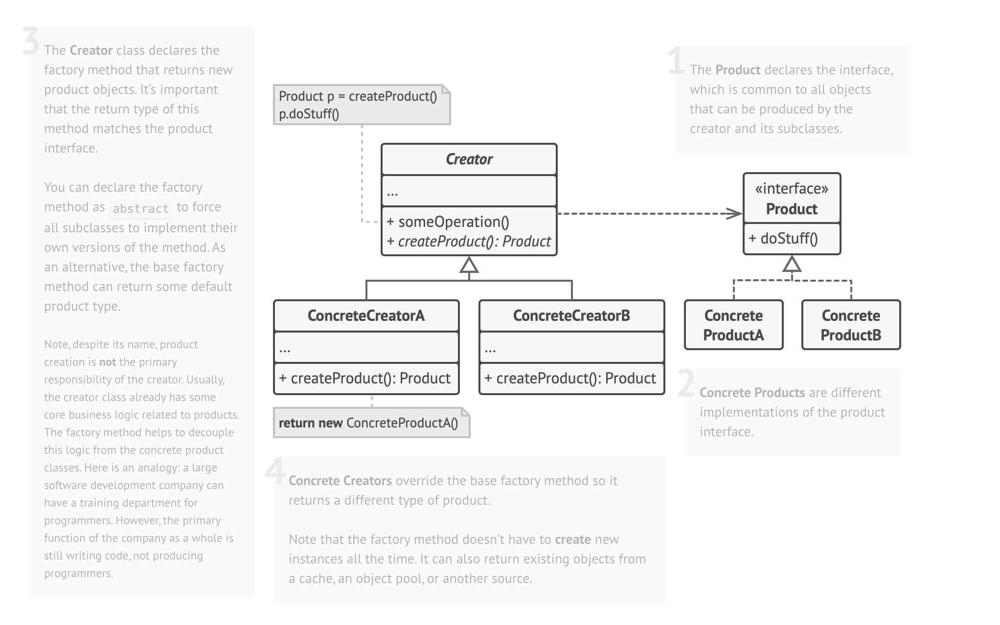

## About Factory Method Project

This project demonstrates the **Factory Method** design pattern in a Laravel-based application. The Factory Method is used to handle the creation of different delivery provider services. This allows for decoupling the creation of object instances from the business logic and making it easier to extend the system with new types of delivery providers.


In this project, the following **DeliveryProviderFactory** classes are implemented:

- **PostProviderFactory** for handling Post-based delivery services.
- **SnappProviderFactory** for handling Snapp-based delivery services.
- **TipaxProviderFactory** for handling Tipax-based delivery services.

Each delivery provider is created dynamically based on the provided type (`post`, `snapp`, `tipax`) through a centralized Factory Method.

## Features

- **Dynamic Factory Method**: Depending on the input type, a corresponding factory class is used to create instances of different delivery services.
- **Extensibility**: You can easily add new delivery provider types by creating a new factory class.
- **Clean Architecture**: The Factory Method pattern helps in keeping the application loosely coupled by abstracting the object creation logic.



## Installation

Clone the repository:

```bash
git clone https://github.com/sara-motamedi/factory-method.git
